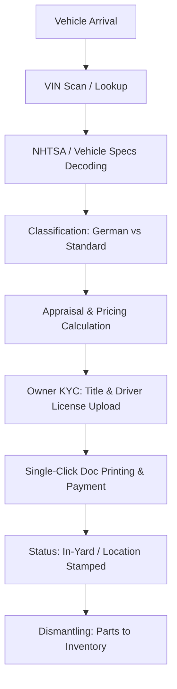

# AutoHub CRM — Master System Architecture & Developer Context Guide

> **Primary Audience**: AI Coding Agents & Human Software Engineers  
> **Last Updated**: September 2026  
> **Scope**: Complete end-to-end blueprint of the AutoHub CRM platform (`auto-hub-backend` and `auto-hub-frontend`).  
> **Production URLs**:
> - **Frontend (CRM Dashboard)**: [https://autohubexpress.us](https://autohubexpress.us)
> - **Backend API**: [https://api.autohubexpress.us](https://api.autohubexpress.us)

---

## 1. Executive Summary & System Context

AutoHub is an enterprise automotive recycling and used auto-parts platform. The CRM acts as the single source of truth for:
1. **Vehicle Acquisitions & Car Intake**: Buying salvage, damaged, or junk vehicles; decoding VINs; collecting title and ID documentation; issuing payments; assigning yard locations; tracking intake status.
2. **Parts Dismantling & Inventory Management**: Cataloging dismantled parts, generating asset tags (barcodes/QR codes), calculating dynamic prices (using vehicle classification algorithms and German vehicle CSV rules), and tracking stock levels.
3. **Multi-Channel Marketplace Syncing**:
   - **Wix eCommerce Store**: Automated deduplicated syncing of inventory parts to the public [autohubexpress.us](https://autohubexpress.us) storefront via Wix Velo serverless HTTP functions.
   - **eBay**: Scheduled 6-hour cron synchronization and real-time reconciliation via eBay REST Inventory API and Trading API.
4. **Customer Check-In & Physical Yard Operations**: Front-desk visitor registry, token badge generation (6-character tokens), digital liability waiver signing with canvas signatures, and entry fee collection.
5. **Customer Request Ingestion**:
   - Customer-submitted Part Requests from public web forms.
   - Customer-submitted Junk Car sell requests.
   - Ingestion from AI Chatbots & WhatsApp Automation Bots via a dedicated shared API key.
6. **Unified Communications & Inbox**:
   - **Email Inbox**: Inbound parse webhook via SendGrid, thread grouping, rich HTML email rendering in sanitized iframes, attachment storage, and outbound replying/forwarding.
   - **Marketplace Inbox**: Centralized messaging dashboard for Facebook, Instagram, WhatsApp, TikTok, and eBay.

---

## 2. Global Repository Hierarchy

```
CRM/
├── auto-hub-backend/                # Node.js/Express REST API & Socket.io server
│   ├── config/                      # Database (Mongoose), Swagger, Logger configurations
│   ├── controllers/                 # Route controllers (Car Intake, Inventory, Auth, Email, etc.)
│   ├── jobs/                        # Cron jobs (eBay catalog sync, eBay listing reconciliation)
│   ├── middleware/                  # Auth (JWT/cookies), AutomationBotAuth, WixAuth, Logging, Uploads
│   ├── models/                      # Mongoose schemas (CarIntake, Part, CRMEmail, PartRequest, etc.)
│   ├── routes/                      # Express route definitions
│   ├── services/                    # Business services (Wix sync, eBay sync, audit logs, email delivery)
│   ├── utils/                       # Pricing logic, VIN decoders, regex escaping, string utilities
│   ├── uploads/                     # Multer disk storage for document attachments & photos
│   ├── server.js                    # Server bootstrap, CORS allowlist, Socket.io, graceful shutdown
│   └── package.json                 # Backend dependencies & scripts
│
├── auto-hub-frontend/               # React 18 + Vite SPA dashboard
│   ├── public/                      # Static brand assets and icons
│   ├── src/
│   │   ├── assets/                  # CSS styles, logos, images
│   │   ├── components/              # Reusable UI widgets
│   │   │   ├── CarIntake/           # Multi-step intake flow components
│   │   │   ├── CheckIn/             # Visitor check-in modals
│   │   │   ├── Dashboard/           # Metrics, revenue trends, and goal cards
│   │   │   ├── Integrations/        # Marketplace integration cards (eBay, Wix, Social)
│   │   │   └── Layout/              # Sidebar, Header, Footer, and App wrapper
│   │   ├── context/                 # React Contexts (AuthContext for user authentication)
│   │   ├── hooks/                   # Custom hooks (useAuth, usePermissions)
│   │   ├── pages/                   # Top-level page views (CarIntake, Requests, Inbox, etc.)
│   │   ├── services/                # Specialized API clients (ordersApi, scrapPurchaseApi, socialApi)
│   │   ├── utils/                   # api.js (Axios HTTP client instance), rbac.js, errorHandler.js
│   │   ├── App.jsx                  # Main application routing configuration
│   │   ├── main.jsx                 # Vite application mount
│   │   └── index.css                # Global stylesheet & Ant Design overrides
│   ├── package.json                 # Frontend dependencies & scripts
│   └── vite.config.js               # Vite build configuration
│
└── project-documentation.md         # This master context document
```

---

## 3. Technology Stack & Key Dependencies

### 3.1 Backend (`auto-hub-backend`)
- **Runtime & Framework**: Node.js (LTS), Express 4.x
- **Database**: MongoDB with Mongoose 8.x
- **Authentication**: JWT (`jsonwebtoken`), Cookie-based session storage (`cookie-parser`), Bcrypt password hashing
- **File Uploads**: `multer` with disk storage (`uploads/`), MIME type validation
- **Real-Time Engine**: `socket.io` for live email and notification events
- **Integrations**:
  - SendGrid (`@sendgrid/mail`) for outbound transactional emails and inbound parsing.
  - eBay REST API (`@ebay/api-client-nodejs` / Axios) & Trading XML API for marketplace listings.
  - Wix Velo serverless function endpoints for live eCommerce store updates.
- **Documentation**: Swagger / OpenAPI 3.0 via `swagger-jsdoc` and `swagger-ui-express`.
- **Scheduled Tasks**: `node-cron` with distributed MongoDB lease locks (`models/EbaySyncRun.model.js`).
- **Template Rendering**: `nunjucks` for dynamic document and receipt printing.

### 3.2 Frontend (`auto-hub-frontend`)
- **Framework & Build**: React 18.3, Vite 7.x
- **Routing**: React Router DOM 7.x
- **UI Component System**: Ant Design (AntD) 5.x, React-Bootstrap 2.x, Bootstrap 5.x
- **Icons**: Ant Design Icons (`@ant-design/icons`), FontAwesome 7.x
- **HTTP Client**: Axios 1.11 configured with `withCredentials: true` and response interceptors
- **Signatures & Scanning**: `react-signature-canvas` for waivers; `html5-qrcode` for VIN and barcode intake
- **Data Visualization**: ApexCharts with `react-apexcharts`

---

## 4. End-to-End Business Workflows

### 4.1 Car Intake Workflow (Vehicle Buying & Processing)
1. **Intake Creation**:
   - Staff navigates to `/car-intake`.
   - Vehicle VIN is entered manually or scanned via barcode/camera.
   - System queries NHTSA / internal VIN decoder to populate Year, Make, Model, Trim, Engine Type, and Fuel Type.
2. **Vehicle Appraisal & Pricing Engine**:
   - Vehicle is classified as **German** (Audi, BMW, Mercedes, Porsche, Volkswagen) or **Standard** using `utils/vehicleClassification.js`.
   - Prices are computed based on mileage, catalytic converter presence, scrap weight, and market resale value.
3. **Owner Identification & KYC**:
   - Customer Driver’s License and Vehicle Title are uploaded to `uploads/`.
   - Physical document validation: Staff verifies title authenticity, lien release, and government ID match.
4. **Document Printing & Payment**:
   - Bill of Sale, Waiver, and Vehicle Intake forms are generated in single-click batch via `carIntakeAPI.printAllDocuments`.
   - System registers cash/check/transfer payout and stamps transaction record.
5. **Status Lifecycle**:
   - `Draft` ➔ `In-Yard` (assigned to Yard Location/Row) ➔ `Dismantled` / `Scrapped` / `Completed`.



---

### 4.2 Parts Inventory & Multi-Channel Marketplace Syncing
1. **Cataloging Dismantled Parts**:
   - Parts stripped from Intake Vehicles are added via `/inventory/add`.
   - Metadata recorded: Part Name, Category, Part Number/OEM, Condition, Location (Shelf/Bin), Vehicle Donor Link.
   - Deterministic SKU generated based on SHA-256 of `Year-Make-Model-Trim-PartName`.
2. **Asset Tagging**:
   - Unique Asset Tag created for each part; barcode/QR printable label generated.
3. **Wix eCommerce Synchronization**:
   - Endpoint: Triggered via `services/wixPartSync.service.js`.
   - Filtering: Excludes excluded parts (`windShield`, `a1`, `a2`).
   - Grouping: Groups identical physical parts into a single Wix Store Product with aggregated `quantity`.
   - Push: Calls Wix Velo function `POST {WIX_VELO_BASE_URL}/_functions/partSync` passing `PART_SYNC_SECRET`.
   - State: On success, marks MongoDB part document `wixSynced: true` and stores `wixProductId`.
4. **eBay Catalog Sync & Reconciliation**:
   - 6-Hour Cron (`jobs/ebayCatalogSyncJob.js`) acquires distributed lease lock in `EbaySyncRun`.
   - Maps parts to eBay Motors categories and pushes active inventory.
   - Reconciliation job (`jobs/ebayListingReconcileJob.js`) checks for sold items and synchronizes quantity.

---

### 4.3 Customer Check-In & Physical Yard Operations
1. **Visitor Registry & Waiver (`CustomerInfoStep.jsx`)**:
   - Customer arrives at front desk; staff selects Buyer or Seller customer type.
   - **Validation Rules**:
     - `mobileNo`: Strictly **mandatory** (red asterisk), formatted dynamically as `(XXX) XXX-XXXX`, and validates that exactly 10 digits are provided.
     - `idProofType`, `idProofNumber`, `idProofImage`, and `signature`: **Optional** fields.
   - Submitting the waiver registers the `Customer` record and immediately opens the "Create Check-In" modal with the customer pre-selected.
2. **"Create Check-In" Modal Lifecycle**:
   - **Responsive UI**: Sized responsively (`maxWidth: calc(100vw - 32px)`, `maxHeight: calc(85vh - 100px)`) with strictly vertical Y-axis scrolling (`overflowY: auto`, `overflowX: hidden`). The digital canvas dynamically adapts without triggering horizontal (X-axis) scrollbars.
   - **Check-In Creation**: Staff enters the Check-In Type (`seller`, `buyer`, `both`), number of persons (1+), and payment method for the entry fee.
   - **Lifecycle Rule**: Check-in records (`CheckIn` model) are created upon submission of this modal. If the staff cancels or dismisses the modal, the customer is saved in the `/waivers` database but will **not appear in the active `/checkins` list** until checked in.
3. **Token Generation & Entry Fee**:
   - System automatically generates a unique 6-character alphanumeric token (e.g. `K9X2P4`).
   - Entry fee transaction is recorded (`Transaction` model, credit) and invoice snapshot is prepared.
   - Printable HTML receipt generated via `GET /api/checkins/:id/print-invoice`.
4. **Check-Out**:
   - Customer returns badge; staff searches by token or customer name on `/checkins` to mark check-out time (`POST /api/checkins/:id/checkout`).
   - Historical records remain viewable under `/checkins/all`.

---

### 4.4 Inbound Leads & Requests Ingestion
AutoHub captures customer leads through three distinct pipelines:

| Channel | Entry Point | Auth Method | Destination Model |
|---|---|---|---|
| **Public Website Form** | `POST /api/part-request` | Public (CORS allowlisted) | `PartRequest` |
| **Public Junk Car Form** | `POST /api/junk-car` | Public (CORS allowlisted) | `JunkCar` |
| **AI / WhatsApp Chatbot** | `POST /api/part-request/automation-bot` | Header `x-automation-bot-key` | `PartRequest` |
| **AI Junk Car Ingestion** | `POST /api/junk-car/automation-bot` | Header `x-automation-bot-key` | `JunkCar` |

- **CRM Triage**: Staff views leads on `/part-requests` and `/junk-car-requests`.
- **Source Badges**: Displays source (`Website`, `Facebook`, `Instagram`, `WhatsApp`, `TikTok`, `eBay`, `Google Business`, `SMS`, `Other`).
- **Conversion to Intake**: Accepted junk car requests are transitioned to Car Intake via `movedToIntake`.

---

### 4.5 Unified Inbox & Email Operations
1. **SendGrid Email Inbox (`/inbox`)**:
   - SendGrid Inbound Parse sends multipart email payloads to `POST /api/email/inbound`.
   - Attachments are stored in `uploads/` with preserved file extensions.
   - Emails are grouped into threads by customer email (`thread_id`).
   - Socket.io broadcasts `new_email` event to active CRM clients.
   - Staff reads emails in a sandboxed, sanitized iframe (`sanitizeForIframe` in `Inbox.jsx`).
   - Staff sends replies and forwards with attachments via `POST /api/email/reply` and `POST /api/email/forward`.
2. **Marketplace Unified Inbox (`/unified-inbox`)**:
   - Real-time customer communication dashboard aggregating Facebook, Instagram, WhatsApp, TikTok, and eBay order messages.

---

## 5. Backend Deep-Dive (`auto-hub-backend`)

### 5.1 Server Entry Point (`server.js`)
- **Port**: Defaults to `5000` (or `process.env.PORT`).
- **CORS Allowlist**:
  ```javascript
  const allowlist = [
    "http://localhost:5173",
    "http://127.0.0.1:5173",
    "http://localhost:3000",
    "http://192.168.1.4:5173",
    "http://192.168.1.4:3000",
    "https://wmshostings.us",
    "https://www.wmshostings.us",
    "https://autohubexpress.us",
    "https://www.autohubexpress.us",
  ];
  ```
  Uses dynamic delegate `corsOptionsDelegate` with `credentials: true`.
- **Socket.io**: Bound to HTTP server; enables real-time client notifications (`app.set("io", io)`).
- **Graceful Shutdown**: Traps `SIGTERM` and `SIGINT` to cleanly terminate cron tasks and release in-flight eBay sync lease locks before exit.

### 5.2 Authentication & Authorization Architecture
1. **Dual-Mode Authentication**:
   Implemented in `middleware/auth.js`:
   - Checks `req.cookies.token` first (httpOnly cookie).
   - If missing, checks `Authorization: Bearer <token>` header.
   - Verifies JWT with `process.env.JWT_SECRET`.
   - Attaches authenticated user to `req.user`.
2. **Role-Based Access Control (RBAC)**:
   - Roles: `admin`, `manager`, `staff`.
   - Middleware: `requireAdmin` (restricts to `admin`), `permit("admin", "manager")`.
3. **Machine-to-Machine API Keys**:
   - `middleware/automationBotAuth.js`: Validates `x-automation-bot-key` against `process.env.AUTOMATION_BOT_API_KEY`.
   - `middleware/wixAuth.js`: Validates `x-wix-api-key` against `process.env.WIX_API_KEY`.

### 5.3 Mongoose Database Models Summary

| Model | File | Primary Purpose | Key Fields |
|---|---|---|---|
| `User` | `models/User.model.js` | CRM staff and administrators | `first_name`, `last_name`, `email`, `password`, `role` (`admin`/`manager`/`staff`) |
| `CarIntake` | `models/CarIntake.model.js` | Purchased vehicle dossiers | `vin`, `make`, `model`, `year`, `price`, `status`, `yardLocation`, `documents` |
| `Part` / `Inventory` | `models/Part.model.js` | Cataloged inventory items | `partName`, `category`, `price`, `sku`, `wixProductId`, `wixSynced`, `ebayListingId` |
| `PartRequest` | `models/PartRequest.model.js` | Customer part inquiries | `name`, `phone`, `email`, `make`, `model`, `year`, `partName`, `source`, `status`, `remark` |
| `JunkCar` | `models/JunkCar.model.js` | Customer junk car offers | `name`, `phone`, `email`, `make`, `model`, `year`, `vin`, `priceOffer`, `movedToIntake` |
| `CRMEmail` | `models/CRMEmail.model.js` | Inbound/outbound email logs | `sender_name`, `sender_email`, `subject`, `body`, `thread_id`, `status`, `attachments` |
| `BackInStockRequest`| `models/BackInStockRequest.model.js` | Customer stock requests | `customer_email`, `product_name`, `product_price`, `notified` |
| `CheckIn` | `models/CheckIn.model.js` | On-premise visitor logs | `customer`, `checkInToken`, `waiverSigned`, `entryFeePaid`, `status` (`in`/`out`) |
| `Waiver` | `models/Waiver.model.js` | Digital liability releases | `customer`, `type` (`Buyer`/`Seller`), `signatureUrl`, `pdfUrl`, `termsAccepted` |
| `EbaySyncRun` | `models/EbaySyncRun.model.js` | Distributed cron lease lock | `runType`, `isLocked`, `leaseExpiresAt`, `heartbeatAt`, `status` |
| `EntryFeeSetting` | `models/EntryFeeSetting.model.js`| Daily yard entry price | `amount`, `currency`, `updatedBy` |
| `IntegrationAccount`| `models/IntegrationAccount.model.js`| OAuth credentials | `platform` (`ebay`/`facebook`), `accessToken`, `refreshToken`, `tokenExpiresAt` |

### 5.4 Backend Route Reference Catalog

```
/api/auth
  POST   /register                    Public user registration
  POST   /login                       Public login (sets cookie + returns JWT)
  GET    /profile                     Authenticated user profile
  POST   /logout                      Clears auth cookie

/api/users
  GET    /                            List all users (Admin/Manager)
  POST   /                            Create user with assigned role (Admin)
  PUT    /:id                         Update user details (Admin)
  DELETE /:id                         Delete user (Admin)

/api/car-intake
  POST   /                            Create car intake entry (multipart or JSON)
  GET    /                            List car intake vehicles with filtering
  GET    /:id                         Fetch full intake dossier
  PUT    /:id                         Update intake details
  PATCH  /:id/status                  Update intake lifecycle status
  POST   /bulk-upload                 Batch intake CSV/Excel upload
  GET    /:id/print-documents         Render dynamic printable documents

/api/part-request
  POST   /                            Public customer form submission
  POST   /automation-bot              Chatbot submission (AutomationBotAuth)
  GET    /                            Fetch all requests (staff triage)
  PUT    /:id                         Update request status
  PATCH  /:id/source                  Update marketing lead source
  PATCH  /:id/remark                  Update internal staff remarks
  DELETE /:id                         Delete request

/api/junk-car
  POST   /                            Public customer junk car submission
  POST   /automation-bot              Chatbot submission (AutomationBotAuth)
  GET    /                            Fetch all junk car submissions
  PATCH  /:id/status                  Update review status
  PATCH  /:id/move-to-intake          Transition junk vehicle into Car Intake

/api/email
  POST   /inbound                     SendGrid Inbound Parse webhook (Public multipart)
  GET    /all                         Fetch email list (Authenticated)
  GET    /thread/:id                  Fetch full conversation thread
  POST   /reply                       Send outbound reply with attachments
  POST   /forward                     Forward email to external address
  PATCH  /mark-read/:id               Mark thread as read

/api/wix
  GET    /parts/sync                  Trigger manual Wix inventory synchronization
  POST   /export/parts/deduplicated   Run deduplicated Velo sync push
```

---

## 6. Frontend Deep-Dive (`auto-hub-frontend`)

### 6.1 Routing Matrix (`src/App.jsx`)

All operational pages are wrapped in `<ProtectedRoute>` and rendered inside the main `<Layout>` with header and collapsible sidebar.

| Route Path | Page Component | Functional Purpose |
|---|---|---|
| `/` | `Dashboard2.jsx` / `Dashboard.jsx` | Executive KPI cards, sales trends, quick actions |
| `/auth-login` | `Login.jsx` | Staff email/password login |
| `/car-intake` | `CarIntake.jsx` | Multi-step vehicle buying form |
| `/car-intake-list`| `CarIntakeList.jsx` | Grid/table of all intake vehicles |
| `/inventory/parts`| `ViewPartsPage.jsx` | Searchable catalog of parts with location and price |
| `/inventory/add` | `AddInventoryPage.jsx` | Form to strip and catalogue parts from a vehicle |
| `/part-requests` | `Requests/Requests.jsx` | Part requests table with source, status, and remarks |
| `/add-part-request`| `AddPartRequest.jsx` | Manual intake of customer part inquiries |
| `/junk-car-requests`| `JunkCarRequests.jsx` | Triage dashboard for vehicle purchase offers |
| `/inbox` | `Inbox.jsx` | SendGrid email client with threading and attachments |
| `/unified-inbox` | `UnifiedInbox.jsx` | Multi-platform social and marketplace messaging |
| `/check-in` | `CheckIn/AllCheckins.jsx` | Visitor logs, token tracking, and check-outs |
| `/waiver` | `Waiver/List.jsx` | Signed customer liability waivers repository |
| `/users` | `Users/UserList.jsx` | Staff role assignment and account administration |
| `/admin/entry-fee`| `Admin/EntryFeeSetting.jsx` | Daily front-desk yard entry charge configuration |

### 6.2 HTTP Client Standard (`src/utils/api.js`)

The application provides a centralized Axios instance configured with credentials:

```javascript
import axios from "axios";

const VITE_API_URL = import.meta.env.VITE_API_URL;

const api = axios.create({
  baseURL: VITE_API_URL,
  timeout: 10000,
  withCredentials: true, // Mandatory: attaches httpOnly session cookies
  headers: {
    "Content-Type": "application/json",
  },
});

export default api;
```

#### Pre-Configured API Client Services:
- `authAPI`: Login, logout, profile checks.
- `carIntakeAPI`: Vehicle creation, retrieval, updates, status changes, document printing.
- `inventoryAPI`: Stock levels, parts lookup, pricing, bin locations.
- `customerAPI` / `buyerAPI` / `sellerAPI`: Directory and transaction tracking.
- `checkInAPI`: Visitor token assignment and badge checkout.
- `waiverAPI`: Digital waiver creation and PDF retrieval.
- `userAPI`: Staff user administration.
- `dashboardAPI`: Financial summaries, revenue trends, and goal tracking.

---

## 7. Critical Architectural Pitfalls & Developer Rules

### Rule 1: NEVER Use Raw `fetch()` for Authenticated Backend Endpoints
- **Why**: Raw browser `fetch(url)` does **not** include cookies cross-origin by default (from `autohubexpress.us` to `api.autohubexpress.us`), nor does it attach authorization headers or handle response interceptors.
- **Consequence**: Backend returns `401 Unauthorized`. Endpoints return `{ error: "No token, authorization denied" }`. In React components expecting an array, calling `.filter()` or `.slice()` on this object throws an unhandled `TypeError`, crashing the page with a blank screen.
- **Standard**: Always import `api` from `src/utils/api.js` (e.g. `api.get("/part-request")`, `api.get("/email/all")`).

### Rule 2: Case-Sensitivity Differences (macOS vs. Linux Production)
- **Filesystem Differences**: macOS (APFS) is case-preserving but case-insensitive. Linux production servers are strictly case-sensitive.
- **Node `require()` paths**: Requiring `./routes/PartRequestRoutes` when the file is named `partRequest.routes.js` works on Mac but **crashes the production server** on startup (`Cannot find module`).
- **Git Branch Names**: Branches like `bugFix` and `bugfix/01-client` collide on macOS because Git cannot create both a directory named `bugfix` and a file named `bugFix` at `.git/refs/remotes/origin/`.

### Rule 3: SendGrid Inbound Parse Webhook Must Stay Public
- **Route**: `POST /api/email/inbound`
- **Security**: Must **never** be wrapped in `auth` middleware. SendGrid's webhook servers send multipart POST requests without user authentication cookies.
- **Attachments**: Stored in `uploads/`. Ensure original file extensions are recovered from SendGrid's `attachment-info` JSON to ensure correct static MIME serving.

### Rule 4: Distributed Cron Job Locking
- **Background**: AutoHub uses MongoDB lease locking (`models/EbaySyncRun.model.js`) to coordinate scheduled jobs across potential restarts and deployments.
- **Implementation**: Never run eBay sync jobs concurrently. Always acquire lock with lease expiration (`acquireLock`), heartbeat during execution (`heartbeat`), and release on completion (`releaseLock`).

---

## 8. Development & Environment Reference

### 8.1 Backend `.env` Configuration (`auto-hub-backend/.env`)
```env
PORT=5000
NODE_ENV=development
MONGO_URI=mongodb+srv://<username>:<password>@cluster.mongodb.net/autohub
JWT_SECRET=your_jwt_secret_key_here
JWT_EXPIRE=7d

# Outbound / Inbound Email (SendGrid)
SENDGRID_API_KEY=SG.your_sendgrid_api_key
EMAIL_FROM=support@autohubexpress.us
BASE_URL=http://localhost:5000

# Wix Integration
WIX_API_KEY=your_wix_api_key
WIX_SITE_ID=your_wix_site_id
WIX_VELO_BASE_URL=https://www.autohubexpress.us
PART_SYNC_SECRET=your_velo_shared_secret

# AI / Chatbot Automation Bot
AUTOMATION_BOT_API_KEY=your_automation_bot_secret_key

# eBay Developer API
EBAY_APP_ID=your_ebay_app_id
EBAY_CERT_ID=your_ebay_cert_id
EBAY_DEV_ID=your_ebay_dev_id
EBAY_REFRESH_TOKEN=your_ebay_refresh_token
```

### 8.2 Frontend `.env` Configuration (`auto-hub-frontend/.env`)
```env
VITE_API_URL=http://localhost:5000/api
VITE_SOCKET_URL=http://localhost:5000
```
*(In production, these point to `https://api.autohubexpress.us/api` and `https://api.autohubexpress.us`)*

---

## 9. Developer Onboarding & Task Execution Checklist

When starting any new feature or bug fix:
1. **Identify the Layer**:
   - UI / Presentation ➔ `auto-hub-frontend/src/pages/` or `components/`
   - Client HTTP Requests ➔ `auto-hub-frontend/src/utils/api.js`
   - API Routing ➔ `auto-hub-backend/routes/`
   - Business Logic ➔ `auto-hub-backend/controllers/` or `services/`
   - Persistence ➔ `auto-hub-backend/models/`
2. **Verify Authentication & Access Level**:
   - Does this route need staff auth? Use `auth`.
   - Is it admin-only? Use `requireAdmin`.
   - Is it called by an external webhook (SendGrid, Wix, Chatbot)? Use the corresponding webhook authentication or leave public.
3. **Verify Request & Response Shapes**:
   - Ensure backend responses match frontend expectations (e.g. `{ success: true, data: [...] }` vs raw arrays).
   - In React components, always defend against unexpected API shapes (e.g. default to empty arrays `Array.isArray(res.data) ? res.data : []`).
4. **Preserve Case-Sensitivity**:
   - Check file naming and module paths against existing imports.
   - Match branch names cleanly avoiding mixed-case collisions.
